# ドキュメント

## RDRAダイアグラム

### ビジネスコンテキスト図

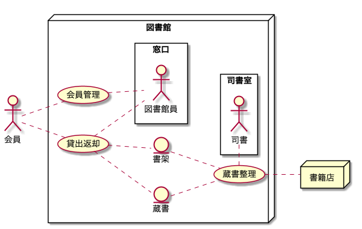

### システムコンテキスト図

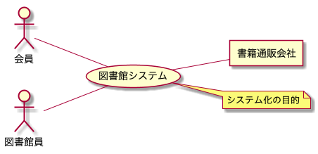

### 要求モデル図

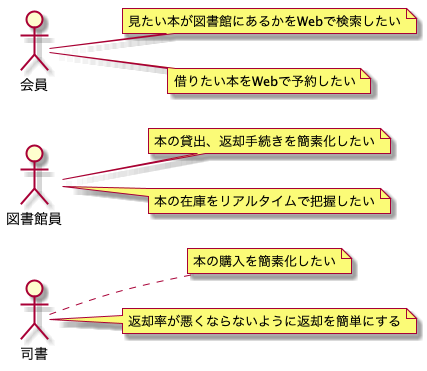

### ビジネスユースケース図

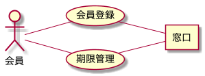

## ER図

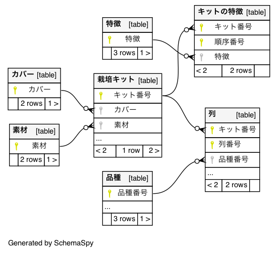

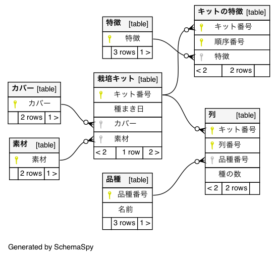

## Jigレポート

### アーキテクチャ図
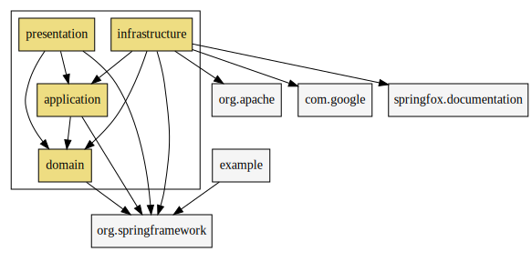

### ビジネスルール関連図
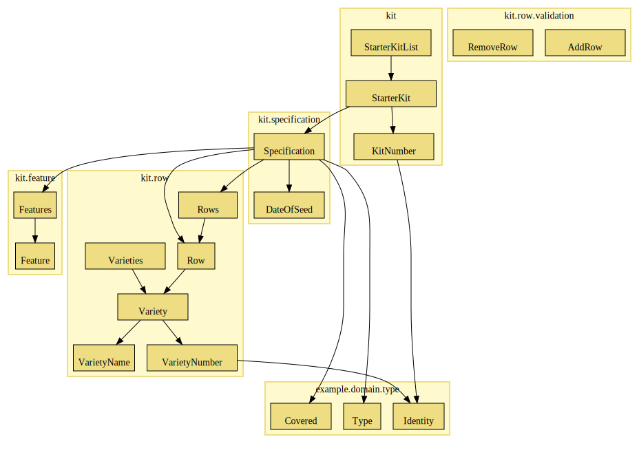

### 区分図
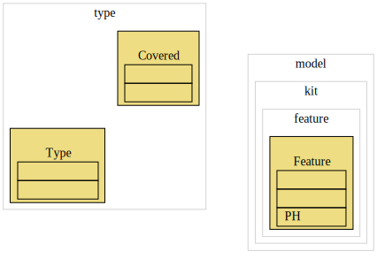

### 区分使用図
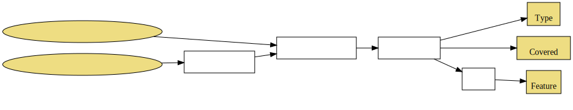

### ユースケース複合図

### パッケージ関連図
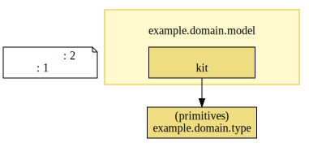

### サービスメソッド呼び出し図
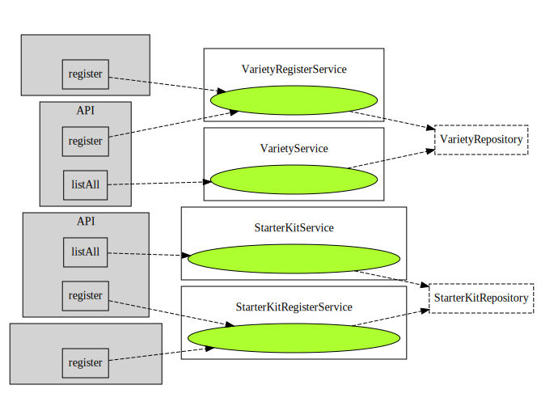

