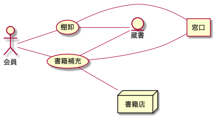
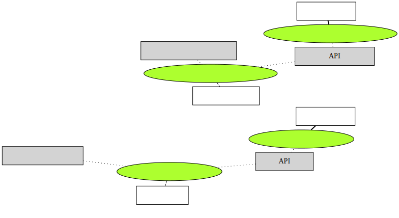

# ドキュメント

## RDRAダイアグラム

### ビジネスコンテキスト図

### システムコンテキスト図

### 要求モデル図

### ビジネスユースケース図

## ER図

## Jigレポート

### アーキテクチャ図

### ビジネスルール関連図

### 区分図

### 区分使用図

### ユースケース複合図

### パッケージ関連図

### サービスメソッド呼び出し図

